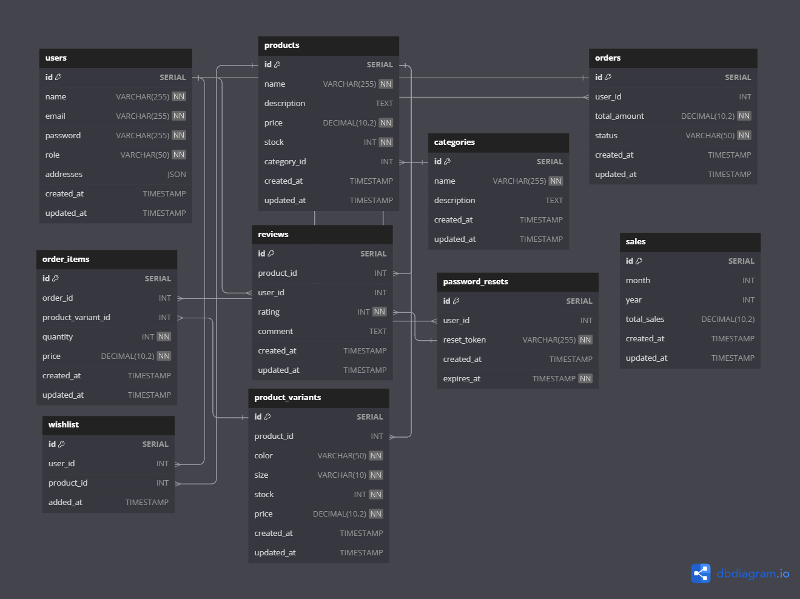

# Ecommerce Shopping API Using Golang gin-gonic Framework and SQLC

## Description

This is a simple Ecommerce Shopping API using Golang gin-gonic Framework with Postgresql Database. This API has the following features:

- User Registration
- User Login
- User Logout
- User Profile Update
- User Password Update
- User Delete
- Product Create
- Product Update
- Product Delete
- Product List
- Product Detail
- Product Search
- Product Filter
- Product Pagination
- Product Review
- Product Rating
- Product Variant Create
- Product Variant Update
- Product Variant Delete
- Product Variant List
- Wishlist Create
- Wishlist Delete
- Wishlist List
- Category Create
- Category Update
- Category Delete
- Category List
- Category Detail
- Order Create
- Order Update
- Order Delete
- Order List
- Order Detail

## Database Schema



## Installation

1. Clone the repository
2. Create a PostgreSQL database
3. Create a .env file and copy the contents from .env.example file
4. Update the .env file with your database credentials
5. Run the following commands

```bash
    go mod download
    go run main.go
```

1. The server will start on http://localhost:8080
2. Use Postman or any other API client to test the API

## Using Docker and makefile

1. Run the following command to build the docker image
    ```bash
    make postgres  # To build the postgres docker image
    make createdb # To create the database
    make migrateup # To run the migrations
    make sqlc      # To generate the sqlc file
    make server    # To run the server
    ```
2. The server will start on http://localhost:8080

## API Documentation

You can find the API documentation in the following link:

1. [Postman Collection](https://documenter.getpostman.com/view/26285529/2sA3XJmQZD#3b8dc65e-8b4b-4d9b-966a-66a933a4fc88)

## License

This project is open-sourced software licensed under the [MIT license](https://opensource.org/licenses/MIT).